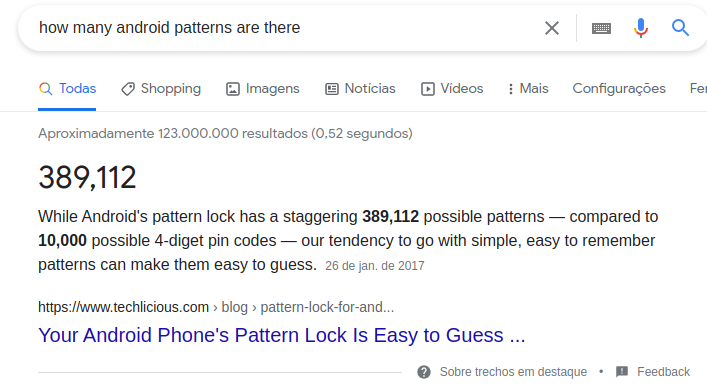
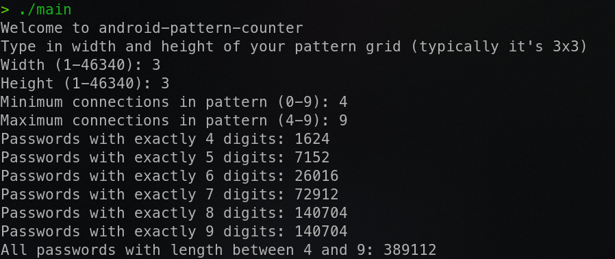

# Android Pattern Counter

A simple approach to solve the problem "How many android unlocking patterns are there".
Made in C++ by me and [LMFRomero](https://github.com/LMFRomero).

Accordingly to google, there are 389,112 patterns.

Considering android patterns are made of 4 to 9 digits, we can check programatically every possible combinations and get to the same results:

The program is flexible and also accepts other sizes, like a 4x4 grid with at least 6 connections and at most 10, which would generate a much more secure system, wich has 994,746,722 password possibilities
